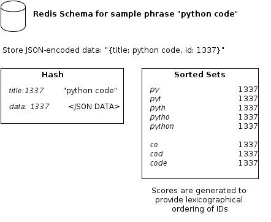

.. _schema:

Schema
======

Term definitions
----------------

The schema is composed of 3 pieces of data, which are the parameters for the
:py:meth:`~RedisEngine.store` method:

object_id
    A unique identifier for the given data, such as a primary key

title
    A title that will be used to generate a searchable index

data
    Any data you wish to associate with an object_id.  This data will be returned
    when searches are performed.

Redis schema
------------

redis-completion uses multiple `sorted sets <http://redis.io/topics/data-types#sorted-sets>`_ to
perform searches for partial phrases.  When indexing a term, it is split up into
pieces of increasing length, so *"test"* becomes ``[te, tes, test]``.  Each of these
partial phrases becomes the key to a sorted set.  Each sorted set contains the IDs
of data that matched that particular phrase.  After finding the IDs, the associated
data is pulled from a `hash <http://redis.io/topics/data-types#hashes>`_ keyed by
the object's id.

